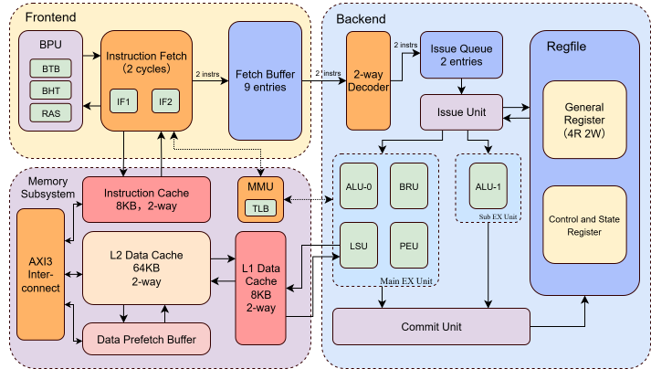

# HIT-OrderCore

## NSCSCC 2026 团队赛二等奖作品

七级流水顺序双发处理器设计，性能测试环境下主频最高支持 105.89 MHz，相比 baseline openla500，整体加速比 5.15，IPC 加速比 1.592（决赛提交版本）

整体加速比

| Benchmark | Scores | Benchmark | Scores |
| --- | ---: | --- | ---: |
| bitcount | 5.26 | fireye_A0 | 24.10 |
| bubble_sort | 3.28 | fireye_B2 | 4.86 |
| coremark | 3.89 | fireye_C0 | 3.29 |
| crc32 | 3.89 | fireye_D1 | 7.69 |
| dhrystone | 3.71 | fireye_I2 | 3.55 |
| quick_sort | 3.98 | inner_product | 10.50 |
| select_sort | 4.29 | lookup_table | 6.04 |
| sha | 3.88 | loop_induction | 7.11 |
| stream_copy | 4.19 | my_memcmp | 6.82 |
| stringsearch | 4.73 | Minmax_sequence | 4.20 |
| **Geo.Mean** | **5.15** | | |

IPC 加速比

| Benchmark | IPCup | Benchmark | IPCup |
| --- | ---: | --- | ---: |
| bitcount | 1.63 | fireye_A0 | 7.46 |
| bubble_sort | 1.01 | fireye_B2 | 1.50 |
| coremark | 1.20 | fireye_C0 | 1.01 |
| crc32 | 1.20 | fireye_D1 | 2.38 |
| dhrystone | 1.14 | fireye_I2 | 1.10 |
| quick_sort | 1.23 | inner_product | 3.25 |
| select_sort | 1.33 | lookup_table | 1.87 |
| sha | 1.20 | loop_induction | 2.20 |
| stream_copy | 1.30 | my_memcmp | 2.11 |
| stringsearch | 1.47 | Minmax_sequence | 1.30 |
| **Geo.Mean** | **1.59** | | |

## 设计特色

### FIFO队列

前端的 pre-IF、IF1、IF2 与后端的 ID、IS、EX、WB 之间由一个最大有效深度为 9 的 Fetch Buffer 解耦，支持每拍 1～2 条指令的读写。因此 I-Cache 缺失只会立即暂停前端，后端仍可继续消耗队列中的指令。

ID/IS 段间寄存器又被改造成了 2 深度 FIFO：当本拍只能发射一条指令时，译码级仍可补入一条，尽量保证下一拍仍有两条指令可供选择。这两层缓冲分别吸收长延迟停顿和单发射气泡，是本设计维持双发利用率的核心。

### 低复杂度的高效非对称双发射机制

主流水线可执行所有指令，副流水线只配置 ALU，不复制 LSU、BRU 和 PEU。当较旧指令是普通运算、较新指令必须使用主流水线时，发射级会动态交换两条指令的执行槽；`turning` 信息随流水线传递，让前递、写回和双写同一寄存器时仍按原程序顺序处理。

若两条都是访存、分支或特权类指令，流水线才退化为单发射。这种设计用少量换槽与恢复逻辑，换取了主要组件只实现一份的面积和时序优势，同时保留每拍最多两条指令的保序提交和精确例外。

### 顺序核性能的核心：高效前递减少停顿

顺序处理器不能像乱序核一样从指令窗口中寻找无关指令绕过数据相关，流水线中的一次 RAW 停顿会直接挡住后续指令。因此，对本设计这样的顺序双发核而言，高效前递是性能的核心之一：双发射提供宽度，FIFO 保持待发射指令充足，而前递决定这些指令能否连续流动。

四个寄存器读端口都会同时比较两条 EX 指令和两条 WB 指令的写回目的寄存器，并结合 `turning` 恢复后的新旧顺序选择最新结果。普通单周期 ALU 指令可直接从 EX 前递到 IS，紧随其后的相关指令无需停顿；同拍两条指令发生 RAW 相关时，较新指令先延后一拍，若较旧指令是普通 ALU 指令，下一拍即可使用这条 EX→IS 通路取数。

Load 的数据受同步 RAM 时序限制，要到 WB 才可用。紧随其后的依赖指令只在 Load 位于 EX 时停顿一拍，下一拍便通过 WB→IS 旁路直接取得 `wb_lsu_result`，无需等待寄存器堆先写后读。因此在 L1 D-Cache 命中时，load-use 相关仅产生一个周期的气泡；只有 Cache 缺失或结果尚未完成的长延迟操作才会继续阻塞流水线。

### FSM复位状态机

以往在处理Cache的Valid位，或者BPU的Valid位时，由于复位需求，通常采用lutram而不是bram实现。我们通过一个内置的复位状态机逻辑，实现了通过BRAM实现Valid位，多周期循环清零。在复位状态机结束前，即使外部复位信号已经结束，依旧认为此时CPU复位尚未结束，必须等待Valid位全部复位结束后CPU才开始取指执行。由此可以节省lut资源，提高频率。（虽然实际项目中只有BPU用了这个逻辑，但这应该是可以推广到Cache的，在CPU core部分集中设计一个复位状态机统一管理所有复位。）

## 完成度

处理器实现了 LoongArch32R 中除浮点外的绝大多数指令、16 项全相联 TLB、完整的地址翻译模式和精确例外，已通过大赛功能测试与性能测试。在项目 SoC 上，可由 U-Boot 引导 Linux，并运行帧缓冲显示、触摸、音频等板级外设；这也作为 MMU、中断和 Cache 正确性的系统级验证。

更完整的设计报告见 [design.docx](./design.docx)，处理器核心实现位于 [`IP/myCPU`](./IP/myCPU)。

## 赛后复盘（碎碎念部分）

参赛之初的设计目标就是顺序双发处理器设计，没有考虑做乱序的原因有二：一是认为乱序工程量过大，以我们队伍的情况难以完成，可能最后烂尾（事实证明单从时间角度讲是足够的，是我们的开发效率过于低下，在选择verilog作为开发语言（而不是chisel、SpinalHDL之类）的同时，也没有很好地利用ai工具带来的生产力提升。CPU core的绝大部分设计都是手搓的，out core的SoC和系统软件倒是在最后使用了很多ai辅助，结果表明ai做的也很不错，是我们过于保守了。另外即使不考虑大模型因素，我们的开发效率也由于队伍分工和合作不足显著低于及格线。）二是幻想着短流水顺序核+高效前递（包括短load-use）+高频是否有可能反超乱序核。事实证明做不到（至少我们没有做到），IPC角度讲，现在的性能测试环境下，由于加入了大量的模拟访存延迟，ROB的作用更为显著（虽然说顺序核也不是不可以添加ROB）而短流水的好处——较短的分支预测恢复周期数大部分被高准确率的分支预测器掩盖了。频率上，决赛答辩时专家提问的原话是“七级流水不足以支持你们的频率（指高频），有没有作特别的优化？”事实上也是有的，但最终很大程度上还是被短流水限制住了。相比长流水的乱序处理器，频率上也不占优势，都是100Mhz出头的水平。

不过顺序核的开发难度确实也小于乱序核，最终我们在决赛中性能分排名第十一左右，虽然卷度有点出乎意料，但也是理所应当的。答辩时处理的也不好，最终很惊险地拿到了二等奖。和同为二等奖前面的作品相比很相形见绌了，个人认为或许多增加一点一等奖名额，或者根据参赛作品的层次动态调整获奖比例是更合理的。

以上是缺点，不过我们的性能成绩在同架构设计（指顺序双发）中应该还是中上水平的，故在上面也提出了一些所谓的设计特色（虽然可能并不特色），仅供参考。

## 参考与致谢

本项目在一级 D-Cache、Uncache 和 AXI 控制部分参考了 [Generic-Cache-Module](https://github.com/fluctlight001/Generic-Cache-Module) 的接口与组织方式，相关状态机按本项目需求重新设计；除法器使用 openLA500 提供的 IP 核。SoC部分参考了[HIT-MaRiver-mips](https://github.com/HIT-MaRiver-mips/soc-mariver)和[MegaSoC](https://github.com/BUAA-CI-LAB/MegaSoC)。感谢相关开源项目与作者。

## Contact

如您对项目的任何部分有疑问，联系方式为QQ:1395727163（备注来意），谢谢。